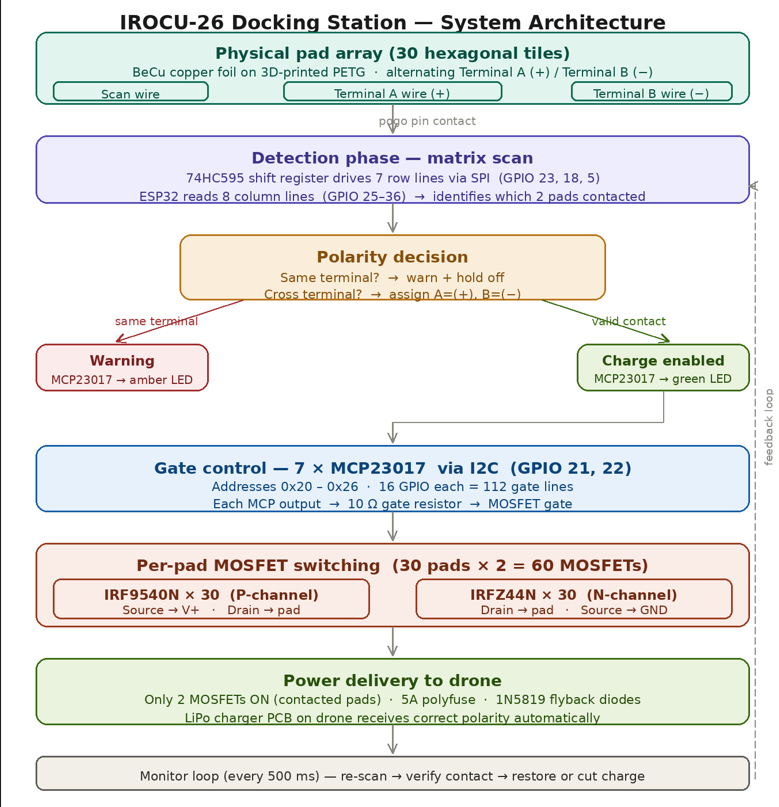
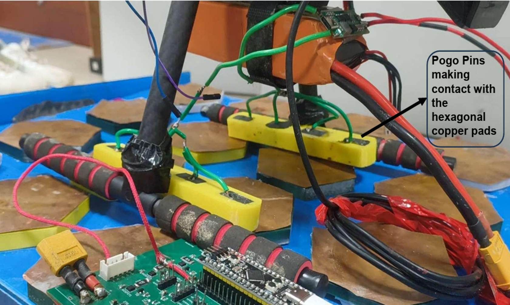
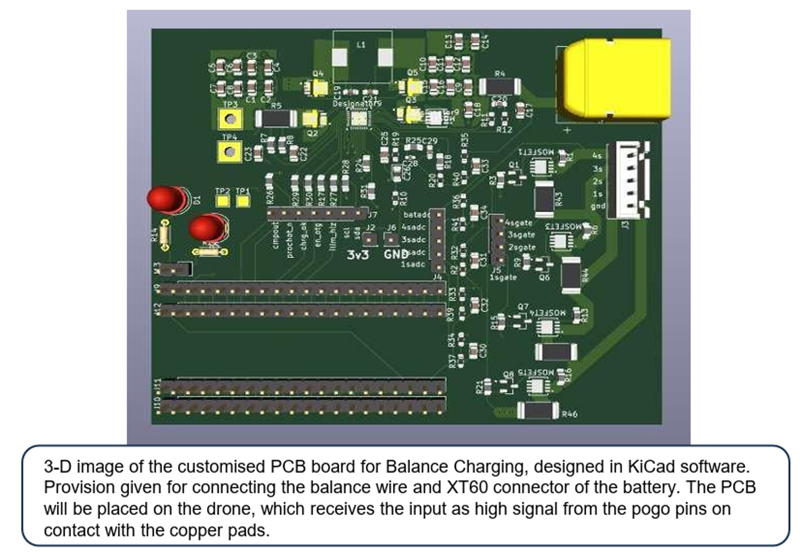
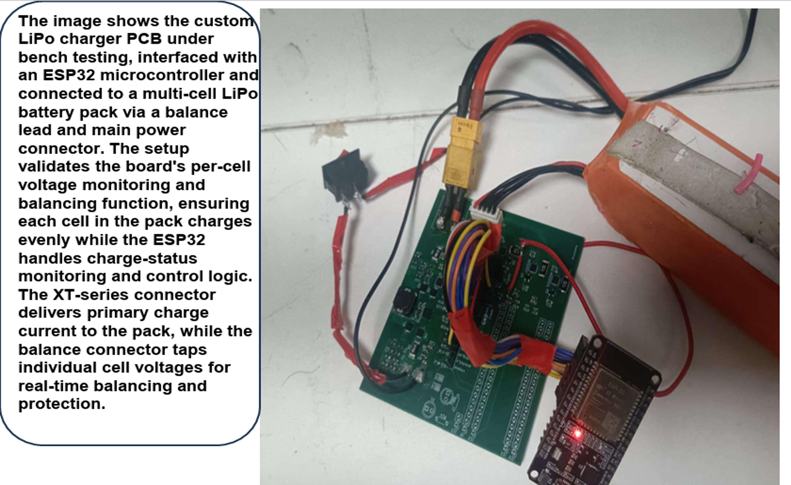
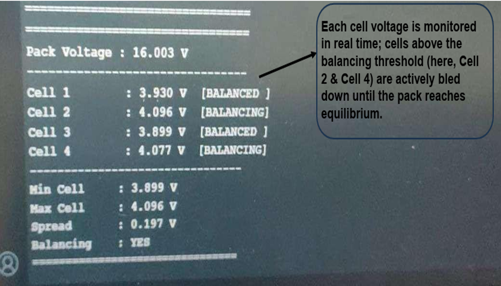

# IROCU-26 — Universal Auto-Docking Charging Station for Autonomous Robots & Drones

**Author:** Mohanraj D S — Chennai Institute of Technology

A self-configuring charging dock that lets an autonomous drone (or ground/legged robot) land anywhere on a pad matrix and get charged correctly, without needing precise mechanical alignment to a fixed contact point.

---

## Demo

<video src="docs/media/base-station-demo.mp4" controls width="720">
  Your browser can't play this video inline — download it from
  <a href="docs/media/base-station-demo.mp4">docs/media/base-station-demo.mp4</a>.
</video>

Base station docking + charging demonstration — the drone lands on the pad array, contacted pads are detected and gated live, and charging begins with no manual alignment.

## 1. Aim

To create a docking station capable of charging a drone that operates **autonomously in a GPS-denied environment**. Because the drone cannot rely on GPS to land with sub-centimetre precision, the dock itself has to tolerate imprecise landings rather than demand exact alignment.

## 2. Problem Statement

Conventional drone charging docks rely on precision mechanical alignment — fixed pogo-pin headers or single-point contacts — requiring the drone to land and make contact at one exact point. This becomes a bottleneck for scaled, unattended deployment, since a human still has to intervene to align or swap batteries when a landing misses.

**Who this affects:**
- Defense & tactical logistics units — UAV/ground-robot fleets needing unattended recharge in remote deployments
- Robotics OEMs & integrators building autonomous UAV, AGV, and legged-robot platforms
- Agri & inspection drone operators running fleets between flights with no crew present
- Disaster & field response units with no crew to hand-align batteries

## 3. Design Journey

This section documents the actual decision process behind the design, not just the final result.

### 3.1 Wired vs. Wireless charging

The first fork in the design was whether to charge the drone's battery wirelessly (inductive) or through a direct electrical contact.

| | Wireless | Wired (contact-based) |
|---|---|---|
| EMI | Can interfere with the drone's onboard sensors | No EMI concern |
| Efficiency | Lower | High |
| Charge time | Higher | Much lower than wireless |
| System complexity | Higher | Needs precise alignment + balance-charging circuitry |
| Alignment tolerance | No precision alignment needed | Precision alignment normally needed |

**Decision: wired/contact-based**, traded off against having to solve the alignment problem separately — which is what the rest of the project is about.

### 3.2 The disadvantage that had to be solved

Going wired reintroduced a harder requirement: to safely balance-charge a multi-cell LiPo pack, the electrical connection can't just land on the pack's main + / − terminals — **the connection has to reach each individual cell tap**, so each cell can be monitored and balanced independently. Doing that *and* tolerating an imprecise landing meant the contact surface itself had to be smart.

### 3.3 Solution Approach 1 — Matrix-scanned pad array

- **Base station side:** an array of independent copper pads.
- **Drone side:** pogo pins.
- Only the pads actually touched by the drone should be powered, so the system first has to **detect which pads are in contact**, then **classify each contacted pad as positive or negative**.
- To do this cheaply, a **matrix scanning algorithm** was used (rows/columns) instead of wiring one GPIO per pad, specifically to keep the microcontroller pin count down.
- **Problem encountered:** matrix scanning introduced **ghosting** (a classic diode-matrix artifact where an unintended pad appears "in contact" due to current sneaking through other closed contacts in the matrix). Working around ghosting drove up circuit complexity and, with it, the BOM. Adding shift registers was considered as a way to scale GPIO count further, but that compounded the same complexity problem rather than solving it.

### 3.4 Solution Approach 2 — One GPIO per pad (the one that worked)

- Simplified the electronics: **each pad gets its own dedicated GPIO**, scanned directly (originally by an Arduino Nano) — no shared row/column lines, so no ghosting.
- Each pad is wired to one GPIO for sensing/contact-detection plus a shared power pin for delivering charge once that pad is confirmed live.
- The mechanical layout was also flipped from the original plan: pogo pins are hard to manufacture reliably into the **base station**, so the pins were moved to the **drone** and the flat copper contact pads were moved to the **base station** — the reverse of Approach 1's layout, and easier to fabricate.

**Result: Solution Approach 2 is the one that worked** and carried forward into the pitched design and the PCB in this repository.

## 4. System Architecture

The pipeline runs as a closed loop, re-scanned every 500 ms:

1. **Physical pad array** — 30 hexagonal tiles, BeCu copper foil on a 3D-printed PETG base, wired as alternating Terminal A (+) / Terminal B (−) with separate scan and terminal wires.
2. **Detection phase (matrix scan)** — a 74HC595 shift register drives 7 row lines over SPI; an ESP32 reads 8 column lines to identify exactly which 2 pads are in contact.
3. **Polarity decision** — a cross-terminal check runs on the ESP32: if both contacted pads are the *same* terminal, it's flagged and held off (amber LED via an MCP23017); if they're *cross*-terminal, it's a valid contact and polarity is assigned A=(+), B=(−) (green LED, charge enabled).
4. **Gate control** — 7× MCP23017 I2C GPIO expanders (addresses 0x20–0x26, 16 GPIO each = 112 gate lines) drive each MOSFET gate through a 10 Ω gate resistor.
5. **Per-pad MOSFET switching** — 30 pads × 2 = 60 MOSFETs: 30× IRF9540N (P-channel, source→V+, drain→pad) and 30× IRFZ44N (N-channel, drain→pad, source→GND).
6. **Power delivery to the drone** — only the 2 MOSFETs for the actually-contacted pads turn on; a 5 A polyfuse and 1N5819 flyback diodes protect the line; the onboard LiPo charger PCB on the drone receives correct polarity automatically, regardless of which physical pads it landed on.

This is what makes the surface inherently safe (every other exposed pad stays de-energized) and **modular/tileable** — the same pad-unit design scales from small drones up to ground robots, legged robots, and multi-unit swarms, just by adding more tiles and expander chips.

## 5. Hardware Implementation

There are two distinct boards in this system — only the second one is the KiCad project in this repository.

### 5.1 Base station electronics (contact detection + gating)

Described by the architecture diagram above: ESP32 + 74HC595 shift register for the row/column matrix scan, 7× MCP23017 I2C expanders driving 60 power MOSFETs (IRF9540N / IRFZ44N) that gate power to individual pads, plus a 5 A polyfuse and flyback diode protection. This logic lives on the dock side, not in this repository.

### 5.2 Onboard drone charger PCB (this repository)

The KiCad project here is the board that rides **on the drone** and receives power the instant its pogo pins land on live, correctly-polarized copper pads from §5.1 — it doesn't need to know which physical pads it touched, only that it's now getting the right polarity.

- **Charge controller:** a TI buck-boost battery charge management IC (BQ2571x family), run from a wide-range DC input so the board isn't tied to one fixed supply voltage.
- **Battery interface:** a 4S LiPo balance connector with individual per-cell voltage sense lines, so each of the 4 cells can be monitored and balanced independently — directly solving the "connection has to reach each individual cell" requirement from §3.2. Bench testing (§7) confirms real-time per-cell monitoring and active balancing.
- **Onboard MOSFET bank:** P-channel high-current switches plus N-channel logic-level driver MOSFETs, supporting the charge/balance paths on the board itself.
- **Current sensing:** precision low-value shunt resistors feeding the charge controller's current-sense inputs, for accurate charge-current regulation.
- **Control interface:** a microcontroller (ESP32 in the bench setup) handles charge-status monitoring and control logic, connected via the board's pin headers; test points are broken out for bring-up and debugging.
- **Mechanical:** power arrives via an XT-series connector; a 3D model of that connector is included in this repo for enclosure/fit checks.

Datasheets and raw PCB/schematic/Gerber files live in the repo but are intentionally not reproduced in this document — see [Repository Layout](#6-repository-layout) for where to find them. The design has gone through several PCB revisions (see commit history), including corrections for connector orientation, copper-pour/ERC issues, and footprint verification against physically purchased parts.

## 6. Repository Layout

| Path | Contents |
|---|---|
| `lipo_Charger.kicad_pro` / `.kicad_sch` / `.kicad_pcb` | Main KiCad project — schematic and PCB |
| `Lipo_charger_sym.kicad_sym` | Custom schematic symbol library |
| `Lipo_Charger_footprint.pretty/` | Custom PCB footprints used in the design |
| `3d models/` | 3D step models for key connectors |
| `production/` | Manufacturing outputs — BOM, netlist, pick-and-place, Gerber archive |
| `Documents/` | Component datasheets referenced during design |
| `BOM.xlsx` | Bill of materials |
| `lipo_Charger-backups/` | Timestamped project auto-backups |
| `docs/images/` | Photos and diagrams used in this README |
| `docs/media/` | Demo video used in this README |

## 7. Photos

| | |
|---|---|
|  Prototype: pogo pins making contact with the hexagonal copper pads on the base station. |  3D render of the onboard balance-charging PCB (drone side), with balance-wire and XT60 provisions. |
|  Bench testing the charger PCB with an ESP32, validating per-cell voltage monitoring and balancing. |  Real-time per-cell voltage log — cells above the balancing threshold are actively bled down until the pack reaches equilibrium. |

## 8. Novelty & Advantages

- **Self-configuring detection** — automatically identifies which pads are in contact and their polarity in real time; no pre-configured contact points needed.
- **Inherent safety** — only pads detected in contact are ever live; the rest of the exposed copper stays de-energized, eliminating shock/short/arc risk.
- **No fixed docking point** — any combination of pads on the array can form the contact; they don't need to be adjacent, unlike single-point docks.
- **Modular, scalable architecture** — tiling additional pad units scales the same core system from small drones to large drones, ground robots, legged robots, and swarms.
- **Lower cost of ownership** — relaxed alignment tolerance removes the need for bespoke, precision docking mechanisms per platform.

## 9. Status

Prototype validated with pogo-pin-to-copper-pad contact and bench-tested balance charging (BQ2571x-class charger IC) alongside a microcontroller running the per-pad contact/polarity scan (Arduino Nano during early development, ESP32 in the base-station matrix scan and in later bench tests). Current PCB revision reflects Solution Approach 2 (§3.4) mechanically, combined with the 30-pad matrix-scan architecture shown in §4.
